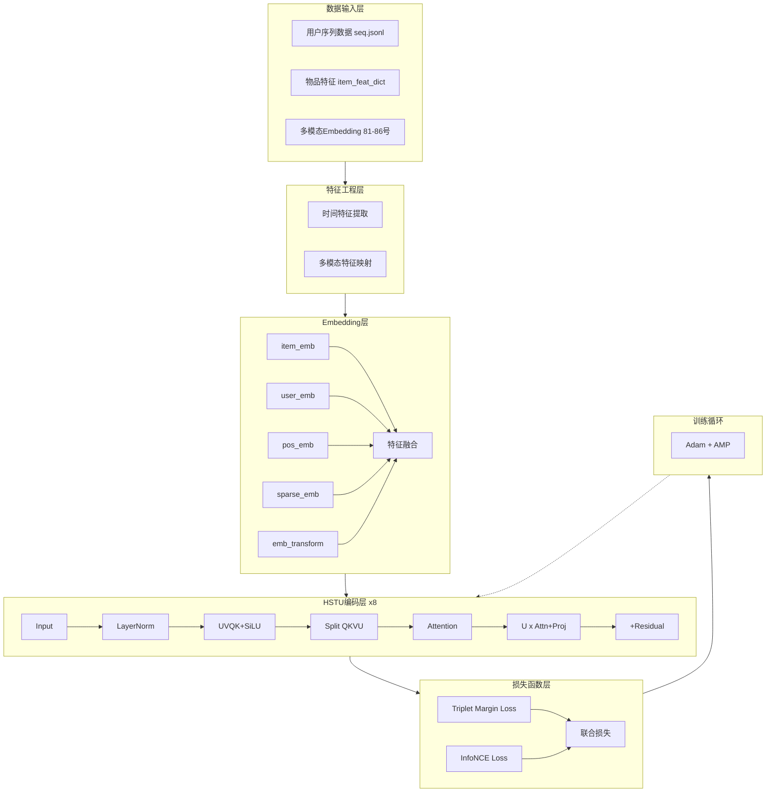
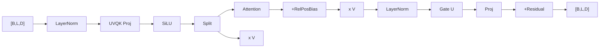
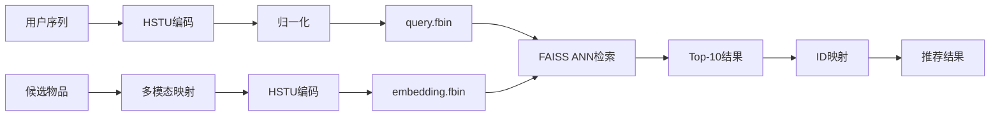

# 腾讯广告推荐系统 - 项目架构与损失函数分析

## 1. 完整训练流程架构



---

## 2. Triplet Margin Loss 计算过程

**计算过程**：首先，通过 `torch.nonzero(next_token_type == 1)` 筛选出序列中所有 item token 的位置索引，再将 batch 维度和序列维度展平为一维索引；然后使用 `torch.index_select` 分别从 log_feats、pos_embs、neg_embs 中提取对应位置的向量，得到 anchor、pos_selected、neg_selected 三个一维向量组；最后计算 `max(0, ||anchor - pos||^2 - ||anchor - neg||^2 + margin)`，其中 margin=1.0，当负样本与锚点的距离比正样本与锚点的距离大至少 margin 时，损失为 0 否则产生正向损失。

**变量说明**：
- **log_feats**：[B, L, D] 形状的用户序列表示，经 HSTU 编码后的输出，每一步的隐藏状态
- **pos_embs**：[B, L, D] 形状的正样本 embedding，由正样本 ID 经过特征融合网络得到
- **neg_embs**：[B, L, D] 形状的负样本 embedding，由随机采样的负样本 ID 经过特征融合网络得到
- **anchor**：展平后的一维向量，取自 log_feats，代表用户序列表示
- **pos_selected**：展平后的一维向量，取自 pos_embs，代表用户下一时刻的真实交互物品
- **neg_selected**：展平后的一维向量，取自 neg_embs，代表用户未交互过的物品

**核心原理**：强制正样本在 L2 空间中靠近锚点（用户序列表示），同时推远负样本，直到两者间距达到安全阈值 margin。

### Triplet Margin Loss 原理详解

**核心思想**：让正样本靠近锚点，让负样本远离锚点，形成"三元组"约束。

**公式**：
$$
L_{triplet} = \frac{1}{N} \sum_{i=1}^{N} \max\left(0, \|a_i - p_i\|_2^2 - \|a_i - n_i\|_2^2 + m\right)
$$

**各符号含义**：
- $a_i$：Anchor，HSTU编码后的用户序列表示（log_feats）
- $p_i$：Positive，正样本，即用户下一时刻实际交互的物品
- $n_i$：Negative，负样本，从用户历史序列中随机选取的未交互物品
- $m = 1.0$：Margin，安全间距阈值

**工作原理**：

```
优化前:                          优化后:
   pos                            pos
    .                              | 拉近
   .                               |
anchor -------- neg   =>     anchor -------- neg
                                  |<间隔m>|
```

1. **当负样本不够远时**：损失为正值，强制推开负样本
2. **当负样本足够远时**：损失为0，无梯度更新

**代码实现**：
```python
triplet_criterion = nn.TripletMarginLoss(margin=1.0, p=2)
indices = torch.nonzero(next_token_type == 1)
index = indices[:, 0] * maxlen + indices[:, 1]
anchor = torch.index_select(log_feats.view(-1, d), 0, index)
pos_selected = torch.index_select(pos_embs.view(-1, d), 0, index)
neg_selected = torch.index_select(neg_embs.view(-1, d), 0, index)
triplet_loss = triplet_criterion(anchor, pos_selected, neg_selected)
```

**项目中的作用**：
- 直接优化用户序列表示到物品的相对空间位置
- 关注个体差异，强制每个三元组满足约束

---

## 3. InfoNCE Loss 计算过程

**计算过程**：首先，对 seq_embs、pos_embs、neg_embs 分别进行 L2 归一化，使余弦相似度等于点积；然后计算归一化后的正样本相似度 `pos_sim = cos(seq, pos)`，以及归一化后的 In-batch 负样本相似度矩阵 `neg_sim = cos(seq, neg_all)`，其中 neg_all 是将 batch 内所有样本的负样本展平后的矩阵；接着将 pos_sim 和 neg_sim 在列维度拼接得到 logits，并除以温度参数 τ=0.07 进行缩放以放大相似度差异；最后使用 Cross Entropy 损失，目标标签为 0（第一列为正样本位置），损失为 `-log(exp(pos_sim/τ) / Σexp(all_sim/τ))`。

**变量说明**：
- **seq_embs**：[B, L, D] 形状的用户序列表示，与 Triplet Loss 中的 log_feats 相同
- **pos_embs**：[B, L, D] 形状的正样本 embedding，与 Triplet Loss 中相同
- **neg_embs**：[B, L, D] 形状的负样本 embedding，与 Triplet Loss 中相同
- **neg_all**：[B×L, D] 形状，将 neg_embs 展平后的矩阵，代表 batch 内所有位置的负样本
- **pos_sim**：[B×L, 1] 形状，每个位置的 query 与其正样本的余弦相似度
- **neg_sim**：[B×L, B×L] 形状，每个 query 与 batch 内所有负样本的余弦相似度矩阵

**核心原理**：在归一化的隐空间中，通过温度缩放控制相似度分布的锐度，迫使模型学会将正样本与负样本区分开来，负样本数量越多对比信号越强。

### InfoNCE Loss 原理详解

**核心思想**：对比学习，将正样本拉近、负样本推远，通过归一化余弦相似度和交叉熵实现。

**公式**：
$$
L_{infoNCE} = -\frac{1}{N} \sum_{i=1}^{N} \log \frac{\exp(sim(q_i, k_i^+) / \tau)}{\exp(sim(q_i, k_i^+) / \tau) + \sum_{j=1}^{M} \exp(sim(q_i, k_j^-) / \tau)}
$$

**各符号含义**：
- $q_i$：Query，归一化后的用户序列表示
- $k_i^+$：Positive，归一化后的正样本
- $k_j^-$：Negative，归一化后的负样本（In-batch Negatives）
- $M \approx B \times L$：负样本数量
- $\tau = 0.07$：温度参数

**工作原理**：

```
归一化空间
   pos              neg1
    .                .
   /                 | 推远
  /                  |
query                |
   \                 .
    \              neg2
     .
    L = -log(P(pos) / ΣP)
```

1. **归一化**：所有向量除以L2范数
2. **温度缩放**：τ越小，hard样本权重越大
3. **交叉熵**：最大化正样本被选中概率

**温度参数 τ 的作用**：

| τ 值 | 效果 | 适用场景 |
|:---:|:---|:---|
| τ → 0 | 难样本主导梯度 | 训练后期 |
| τ = 0.07 | 适中平衡 | 常规训练 |
| τ → ∞ | 所有负样本等权 | 训练初期 |

**代码实现**：
```python
# 归一化
seq_embs = seq_embs / seq_embs.norm(dim=-1, keepdim=True)
pos_embs = pos_embs / pos_embs.norm(dim=-1, keepdim=True)
neg_embs = neg_embs / neg_embs.norm(dim=-1, keepdim=True)

# 相似度计算
pos_logits = F.cosine_similarity(seq_embs, pos_embs, dim=-1).unsqueeze(-1)
neg_logits = torch.matmul(seq_embs, neg_embs.reshape(-1, d).transpose(-1, -2))

# 合并 + 温度缩放
logits = torch.cat([pos_logits, neg_logits], dim=-1) / self.temperature
loss = F.cross_entropy(logits, torch.zeros(len(logits), dtype=torch.long))
```

**项目中的作用**：
- 关注全局对比，从batch内学习区分正负样本
- 配合Triplet Loss双重约束

---

## 4. 两种损失函数对比

| 维度 | Triplet Margin Loss | InfoNCE Loss |
|:---|:---|:---|
| 负样本来源 | 随机负采样 | In-batch Negatives |
| 距离度量 | L2距离 | 余弦相似度 |
| 损失形式 | Hinge Loss | Cross Entropy |
| 关注点 | 个体差异 | 全局对比 |
| 梯度特性 | margin不满足时才有梯度 | 所有样本都有梯度 |

---

## 5. 联合损失函数

**公式**：
$$
L_{total} = L_{triplet} + \alpha \cdot L_{infoNCE}, \quad \alpha = 0.5
$$

**为什么可以相加**：
- 两者梯度方向一致：拉近正样本、推远负样本
- 量级通过α调节，防止一方主导

---

## 6. HSTU Block 内部结构



---

## 7. 推理流程架构



---

## 8. 特征类型汇总

| 特征类型 | 特征ID | Embedding方式 |
|:---:|:---:|:---|
| item_sparse | 100-122 | Embedding Table |
| user_sparse | 103-109 | Embedding Table |
| user_array | 106-110 | Embedding + Sum |
| item_emb | 81-86 | Linear Projection |
| hour | 200 | Embedding Table |
| weekday | 201 | Embedding Table |
| log_gap | 203 | 直接拼接 |
| month | 204 | Embedding Table |
| time_decay | 205 | 直接拼接 |

---

## 9. 关键超参数

| 参数 | 值 | 说明 |
|:---:|:---:|:---|
| hidden_units | 128 | 隐空间维度 |
| num_blocks | 8 | HSTU层数 |
| num_heads | 8 | 注意力头数 |
| maxlen | 101 | 最大序列长度 |
| batch_size | 128 | 批次大小 |
| temperature | 0.07 | InfoNCE温度 |
| triplet_margin | 1.0 | Triplet Loss margin |
| infonce_alpha | 0.5 | InfoNCE权重 |

---

## 10. 时间特征详细使用流程

### 10.1 时间特征概述

本项目共使用 5 种时间特征，均由原始时间戳提取和变换得到，用于捕捉用户的周期行为模式和兴趣演变趋势。

| 特征ID | 名称 | 维度 | 提取方式 | 模型处理 |
|:---:|:---:|:---:|:---|:---|
| 200 | hour | 25 | (ts + 8h) % 86400 // 3600 | Embedding Table |
| 201 | weekday | 8 | (ts // 86400 + 4) % 7 + 1 | Embedding Table |
| 203 | log_gap | 连续 | log(1 + gap)，gap为相邻时间差 | 直接拼接 |
| 204 | month | 13 | pandas.to_datetime(ts).month | Embedding Table |
| 205 | time_decay | 连续 | log(1 + (last_ts - ts) / τ)，τ=86400s | 直接拼接 |

### 10.2 时间特征计算过程

```
原始数据 (seq.jsonl)
     │
     ▼
每条记录包含: [user_id, item_id, user_feat, item_feat, action_type, timestamp]
     │
     ▼
时间特征提取 (_add_time_features)
     │
     ├─► hour ──────► (ts + 8*3600) % 86400 // 3600  ──► 0-23
     │
     ├─► weekday ───► ((ts // 86400 + 4) % 7) + 1     ──► 1-7
     │
     ├─► log_gap ───► log(1 + (ts[i] - ts[i-1]))      ──► 连续值
     │
     ├─► month ─────► pd.to_datetime(ts).month         ──► 1-12
     │
     └─► time_decay ► log(1 + (last_ts - ts[i]) / τ)  ──► 连续值
            ▲
            │ last_ts = 序列最后一个时间戳（当前时刻）
            │ τ = 86400（1天）
```

### 10.3 时间特征嵌入特征工程

**第一步：写入 user_feat**

在 `_add_time_features` 中，时间特征先被写入 `user_feat` 字典：

```python
user_feat["200"] = int(hours[idx])      # hour
user_feat["201"] = int(weekdays[idx])   # weekday
user_feat["203"] = float(log_gap[idx])  # log_gap
user_feat["204"] = int(months[idx])     # month
user_feat["205"] = float(delta_scaled[idx])  # time_decay
```

**第二步：转移到 item_feat**

在 `__getitem__` 中，通过 `_transfer_context_features` 将时间特征从 user_feat 转移到 item_feat：

```python
i_feat = self._transfer_context_features(
    u_feat, i_feat, ["200", "201", "203", "204", "205"]
)
```

这样做的目的是让时间特征与对应的 item 关联，便于后续的特征融合。


### 10.4 时间特征在模型中的处理

**sparse 类型（Embedding Table）**

```python
feat_types['item_sparse'] = [
    '200',  # hour
    '201',  # weekday
    '204',  # month
]

# 模型中创建 Embedding Table
for k in self.ITEM_SPARSE_FEAT:
    self.sparse_emb[k] = torch.nn.Embedding(self.ITEM_SPARSE_FEAT[k] + 1, args.hidden_units)
```

- **hour**：维度 25（0-23 + padding）
- **weekday**：维度 8（0-6 + padding）
- **month**：维度 13（0-12 + padding）

**continual 类型（直接拼接）**

```python
feat_types['item_continual'] = ['203', '205']  # log_gap, time_decay

# 在 feat2emb 中
elif feat_type.endswith('continual'):
    feat_list.append(tensor_feature.unsqueeze(2))  # 直接拼接，不做 Embedding
```

### 10.5 时间特征的设计动机

| 特征 | 捕捉的信息 | 设计动机 |
|:---|:---|:---|
| hour | 一天内的时段 | 用户可能在早上/中午/晚上有不同的行为模式 |
| weekday | 一周内的星期 | 工作日和周末的兴趣可能有显著差异 |
| log_gap | 相邻行为的时间间隔 | 反映用户的行为频率（高频/低频用户） |
| month | 月份 | 季节性购物/广告偏好变化 |
| time_decay | 距今的时间衰减 | 用户兴趣随时间推移而衰减，近期行为更重要 |

### 10.6 为什么用 log 变换

时间间隔跨度巨大（秒级到月级），直接使用会导致数值不稳定。log 变换将其压缩到合理范围：

```
gap = 0s      -> log(1+0) = 0
gap = 1min    -> log(1+60) = 4.11
gap = 1hour   -> log(1+3600) = 8.19
gap = 1day    -> log(1+86400) = 11.37
gap = 1week   -> log(1+604800) = 13.31
```

同时保留了对短间隔的敏感度：1分钟和5分钟的差异（4.11 vs 5.79）比1天和2天的差异（11.37 vs 12.20）更明显。
